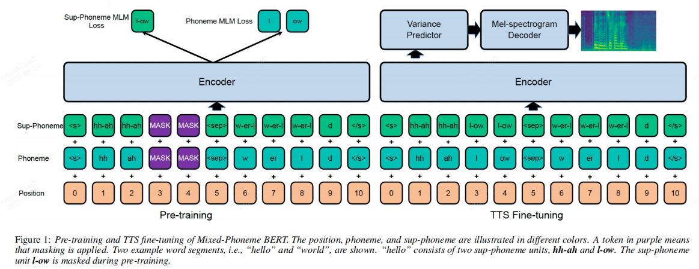

An unofficial PyTorch implementation of Mix-Phoneme-Bert([Mixed-Phoneme BERT: Improving BERT with Mixed Phoneme and Sup-Phoneme Representations for Text to Speech](https://arxiv.org/abs/2203.17190))




## Installation


## Data Prepare
Prepare your data like file /data/data.txt
then 
```
bash prepare_data.sh
bash bpe.sh
bash preprocess.sh
```

## Training
```
bash train.sh
```